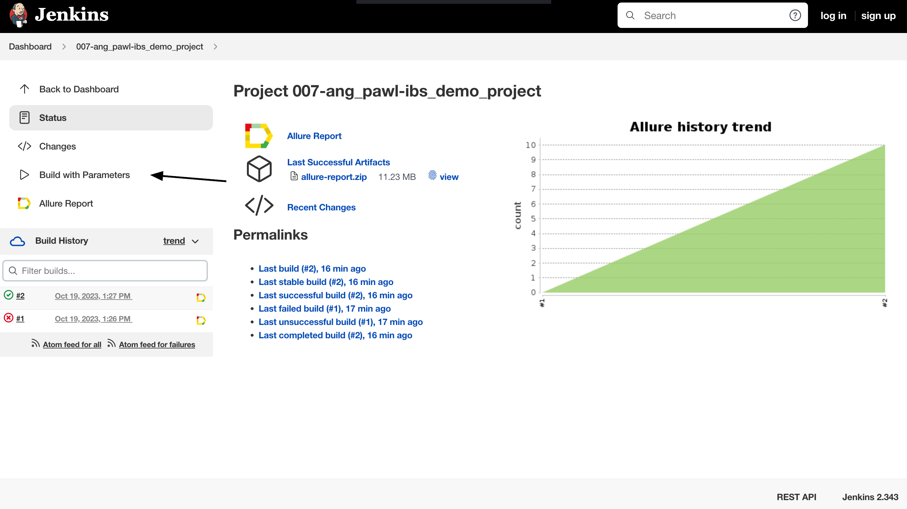
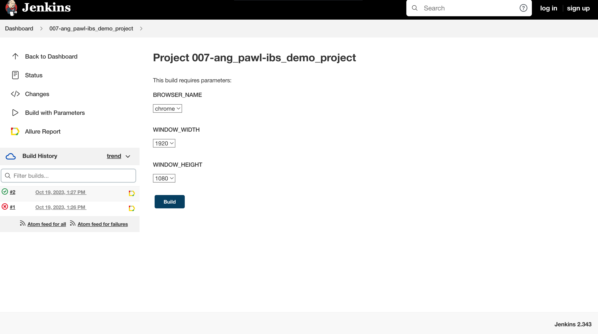
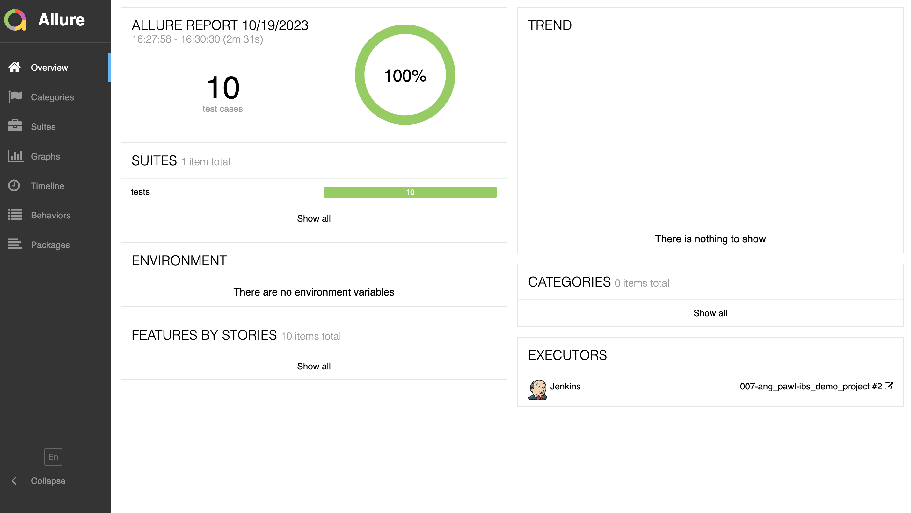
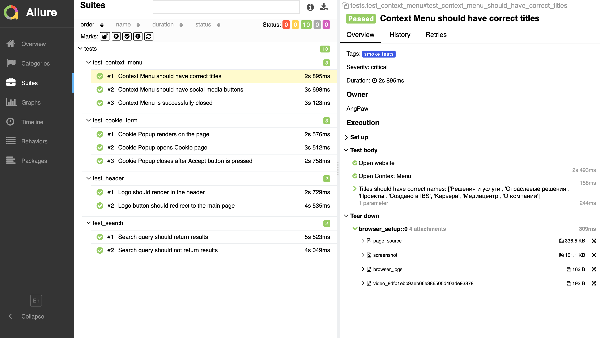
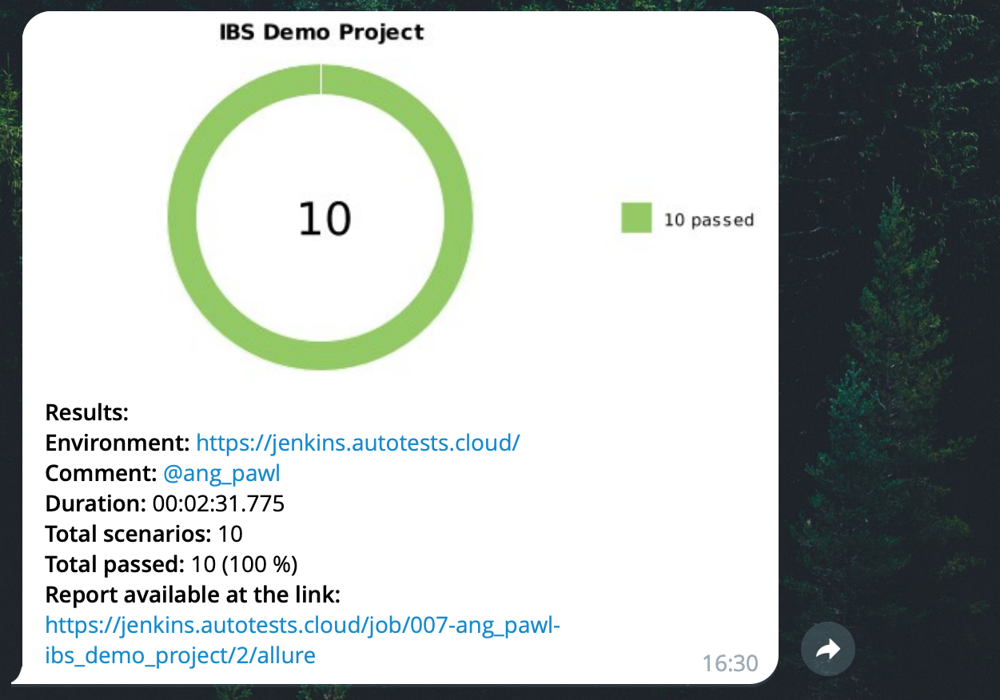

# Демонстрационный проект UI-тестов для лендинга компании <a target="_blank" href="https://ibs.ru/">IBS</a>


### Стек технологий:
<code></code>
<code></code>
<code></code>
<code></code>
<code></code>
<code></code>
<code></code>
<code></code>
<code></code>
<code></code>

### Реализованные проверки:
- Предупреждение о сборе cookies:
  - Присутствует на странице
  - Успешно открывает страницу с информацией по использованию cookies по кнопке "Узнать подробности"
  - Успешно пропадает после клика на кнопку Accept All
- Контекстое меню:
  - Наименования разделов сайта отображаются корректно
  - Отображаются кнопки соцсетей
  - Окно успешно закрывается по клику на кнопку "Закрыть"
- В хедере сайта присутствует и отображается логотип компании
- Логотип компании успешно редиректит пользователя на главную страницу сайта
- Поиск по сайту:
  - Выдает результаты по валидному запросу
  - Не выдает результаты по невалидному запросу

### Для локального запуска автотестов необходимо:

1. Склонировать репозиторий

```bash
git clone https://github.com/AngPawl/ibs_demo_project
```

2. Создать `.env` файл по образцу в корневой папке проекта

3. Установить и активировать python интерпретатор

```bash
python -m venv .venv
source .venv/bin/activate
```

4. Установить пакет poetry

```bash
pip install poetry
```

5. Установить зависимости

```bash
poetry install
```

6. Запустить тесты в командной строке

```bash
pytest .
```

### Удаленный запуск автотестов производится на сервере <a target="_blank" href="https://selenoid.autotests.cloud/#/">Selenoid</a> при помощи созданной в Jenkins <a target="_blank" href="https://jenkins.autotests.cloud/job/007-ang_pawl-ibs_demo_project/">джобы</a>.

### Для удаленного запуска автотестов необходимо:
- Открыть подготовленную <a target="_blank" href="https://jenkins.autotests.cloud/job/007-ang_pawl-ibs_demo_project/">джобу</a> в Jenkins
- Нажать "Build with Parameters" в боковом меню
- После выбора параметров нажать "Build"




### Можно задать следующие параметры:
- BROWSER_NAME (браузер, в котором запустятся тесты): chrome, firefox
- WINDOW_WIDTH (ширину экрана): 1920, 1366
- WINDOW_HEIGHT (высоту экрана): 1080, 768

#### *После прохождения автотестов можно зайти в Allure Report и посмотреть отчет по тестовому прогону:*



#### *Также можно подробно посмотреть результат прохождения каждого отдельного теста:*



### Для мгновенного получения результатов о тестировании настроено автоматическое оповещение через Telegram.


### Ниже на видео представлен пример короткого теста на сервере <a target="_blank" href="https://selenoid.autotests.cloud/#/">Selenoid</a>.


